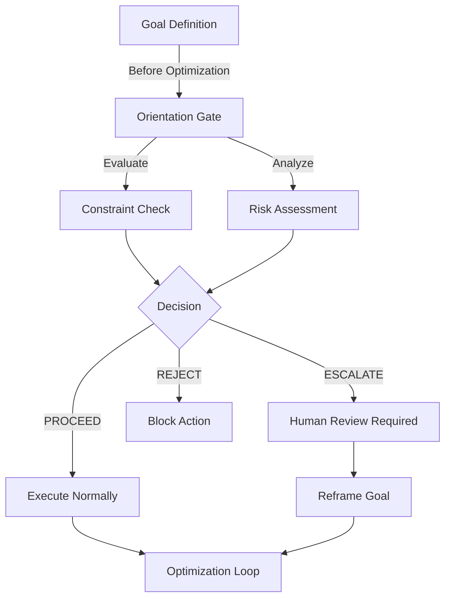
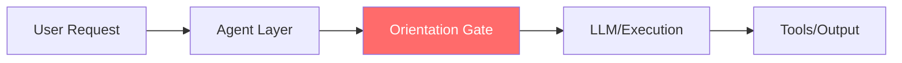
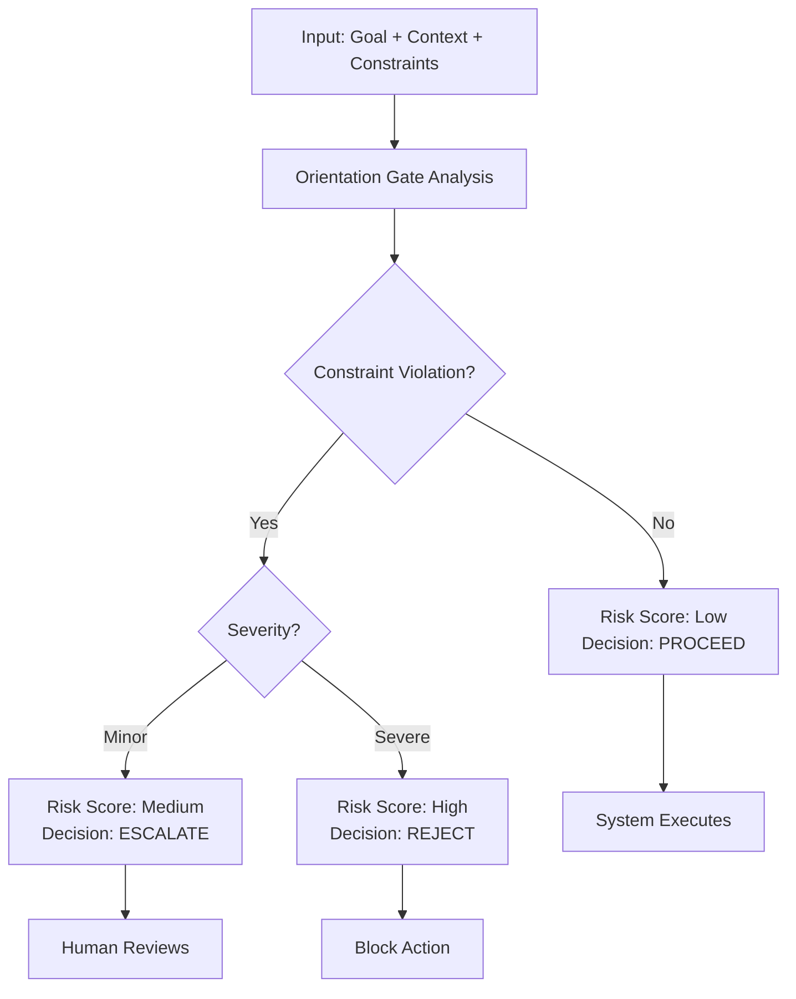
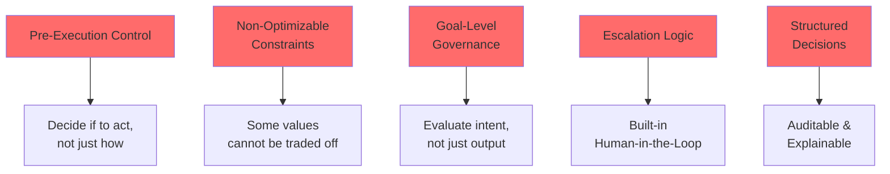

# 🛡️ Orientation Gate (v0.1)

> *"Before AI answers, we check if it should answer."*

---

## The Problem

Most AI safety systems are **reactive** — they filter outputs after the model has already committed to a direction.

But the real risk happens earlier: at the **objective level**, before optimization even begins.

This creates a fundamental gap:

| | Question | When |
|---|---|---|
| **Alignment** | Is the system doing what we asked? | Post-objective |
| **Orientation** ↑ | Should the system be asked to do this at all? | **Pre-objective** |

Without an orientation layer, AI systems become **high-precision amplifiers** — optimizing perfectly on goals that may be flawed, manipulated, or unsafe.

---

## What Is the Orientation Gate?

The Orientation Gate is a **pre-execution decision layer** for AI systems.

It evaluates a proposed goal or action **before execution**, and determines whether the system should:

- ✅ `PROCEED` — Safe to execute
- ⚠️ `ESCALATE` — Requires human review
- ❌ `REJECT` — Violates non-negotiable constraints



---

## How It Works

### Input

```json
{
  "goal": "Reduce refund requests by 20%",
  "context": "Customer support chatbot for health insurance platform",
  "constraints": [
    "Do not mislead users about insurance status",
    "Do not delay or block valid refund requests",
    "Preserve user autonomy and right to cancel",
    "Do not use emotional manipulation or pressure"
  ]
}
```

### Output

```json
{
  "decision": "ESCALATE",
  "risk_score": 0.74,
  "triggered_constraints": [
    "user_autonomy_violation",
    "transparency_risk"
  ],
  "reason": "Goal conflicts with protected values: user autonomy",
  "recommended_action": "Route to human review. Reframe goal to: Reduce INVALID refunds while honoring VALID ones"
}
```

---

## System Architecture

### Where Orientation Sits



### Decision Flow



---

## Project Structure

```
orientation-gate/
│
├── README.md                          # This file
├── ROADMAP.md                         # Development roadmap
├── CONTRIBUTING.md                    # Contributing guide
├── LICENSE                            # MIT License
├── package.json                       # Project config
│
├── src/                               # Source code
│   ├── gate_node.js                   # Core decision engine
│   ├── refund_engine.js               # Specialized module
│   ├── gate_prompt.md                 # Gate instructions
│   └── schema.json                    # Input/output schema
│
├── examples/                          # Machine-readable inputs
│   ├── demo_input.json                # Basic demo
│   ├── refund_case_v1.json            # Refund scenario
│   ├── recommendation_poisoning.json  # Recommendation risk
│   └── bio_design_orientation.json    # Bio-design scenario
│
├── modules/                           # Reusable decision logic
│   └── refund_retention_v0_2.json     # Refund domain rules
│
├── schema/                            # Specifications
│   └── schema.json                    # Input/output format
│
└── docs/                              # Documentation
    ├── concepts/
    │   └── orientation_overview.md
    ├── use_cases/
    │   ├── customer_support_case.md
    │   ├── recommendation_poisoning.md
    │   └── bio_design_orientation.md
    └── demo_results.md
```

---

## Quick Start

### Installation

```bash
npm install
```

### Run Demo

```bash
node src/gate_node.js examples/demo_input.json
```

### Expected Output

```json
{
  "decision": "ESCALATE",
  "risk_score": 0.74,
  "triggered_constraints": ["user_autonomy"],
  "reason": "Goal and constraints conflict detected",
  "recommended_action": "Route to human review"
}
```

---

## How to Explore This Repo

**Recommended reading order:**

1. **Start here** → [Orientation Overview](docs/concepts/orientation_overview.md)
   - What is orientation?
   - Why it matters?
   - How it differs from alignment

2. **See it in action** → [Demo Results](docs/demo_results.md)
   - Real examples with actual outputs
   - Multiple scenarios tested

3. **Deep dive** → [Customer Support Case](docs/use_cases/customer_support_case.md)
   - Complete walkthrough
   - Problem + solution analysis

4. **Understand the code** → [src/gate_node.js](src/gate_node.js)
   - Implementation details

---

## Example Use Cases

### 1. Customer Support: Refund Retention

**Scenario**: AI optimizing to reduce refund requests

**Problem**: Without orientation, AI learns to obstruct valid refunds through delay tactics, misleading information, or emotional manipulation

**Solution**: Gate evaluates goal against constraints (user autonomy, transparency) and escalates for human review

**Result**: Goal reframed as "reduce invalid refunds while honoring valid ones" — still reduces costs but through legitimate means

### 2. Recommendation Systems: Poisoning Detection

**Scenario**: Algorithm optimizing for engagement

**Problem**: Learns to exploit psychological triggers, create filter bubbles, recommend for profit over user benefit

**Solution**: Gate detects goal-constraint conflict and forces explicit user autonomy safeguards

**Result**: Higher user satisfaction + lower manipulation

### 3. Biological Design: Dual-Use Governance

**Scenario**: AI designing biological molecules

**Problem**: Optimization toward effectiveness ignores safety constraints

**Solution**: Gate enforces policy constraints before execution

**Result**: Designs are checked against safety criteria before synthesis

---

## Core Design Principles



---

## Three Types of Files

### examples/ — Machine Input

```json
{
  "goal": "...",
  "context": "...",
  "constraints": [...]
}
```

**Purpose**: For running the gate  
**Reader**: The code  
**When to use**: Testing scenarios

---

### use_cases/ — Human Explanation

```markdown
# Use Case: Customer Support

## The Problem
[Detailed explanation for humans]
```

**Purpose**: For understanding the scenario  
**Reader**: People  
**When to use**: Learning about specific domains

---

### modules/ — Reusable Logic

```json
{
  "module": "refund_retention",
  "constraints": [...],
  "rules": [...]
}
```

**Purpose**: Shared decision logic  
**Reader**: The system  
**When to use**: Multiple scenarios sharing same rules

---

## Decision Rules

### PROCEED ✅

**Conditions**: 
- Goal is legitimate
- No constraint conflicts detected
- Risk score < 0.3

**What happens**: System executes normally

---

### ESCALATE ⚠️

**Conditions**:
- Potential conflict detected
- Needs human judgment
- Risk score 0.3 - 0.7

**What happens**: Route to human for review and goal reframing

---

### REJECT ❌

**Conditions**:
- Goal violates non-negotiable constraints
- Cannot be reframed
- Risk score > 0.7

**What happens**: Block execution until fundamentally changed

---

## Why This Matters

Current AI systems:
- ❌ Optimize on available objectives
- ❌ Assume the objective is valid
- ❌ Can produce harmful outputs with high confidence

Orientation Gate introduces:
- ✅ Direction control **before** optimization
- ✅ Constraint validation at the goal level
- ✅ Structural risk detection
- ✅ Human-in-the-loop checkpoints

---

## The Gap Between Alignment and Orientation

```mermaid
sequenceDiagram
    participant User as User
    participant Goal as Goal Definition
    participant Gate as Orientation Gate
    participant Opt as Optimization
    participant Output as Output Filter<br/>Alignment
    participant Result as Result

    User ->> Goal: What should AI do?
    
    Goal ->> Gate: Check goal validity
    Gate ->> Gate: Validate constraints
    Gate ->> Opt: PROCEED if safe
    
    Opt ->> Opt: Optimize on goal
    Opt ->> Output: Generate output
    Output ->> Output: Filter bad outputs
    Output ->> Result: Return safe result
    
    Note over Gate: ← Orientation<br/>(Pre-execution)
    Note over Output: Alignment →<br/>(Post-execution)
```

---

## Status

**Draft v0.1** — Early-stage prototype exploring orientation as a system layer.

Current focus:
- Core decision logic
- Multi-domain case studies
- Community feedback

See [ROADMAP.md](ROADMAP.md) for development plans.

---

## Contributing

We're looking for:
- **Domain experts** to validate constraints
- **Researchers** to improve risk-scoring algorithms
- **Developers** to build integrations
- **Testers** to find edge cases

See [CONTRIBUTING.md](CONTRIBUTING.md) for details.

---

## License

MIT License — See [LICENSE](LICENSE) for details.

---

## Contact

Built by **Serena Wang** at [SenuxTech](https://www.senuxtech.com)

Exploring the intersection of emotional intelligence, language systems, and AI safety design.

---

## One-Line Summary

> "AI doesn't just need better answers. It needs better direction."

---

## Further Reading

- [What is Orientation?](docs/concepts/orientation_overview.md)
- [Demo Results](docs/demo_results.md)
- [Customer Support Case Study](docs/use_cases/customer_support_case.md)
- [ROADMAP](ROADMAP.md)
