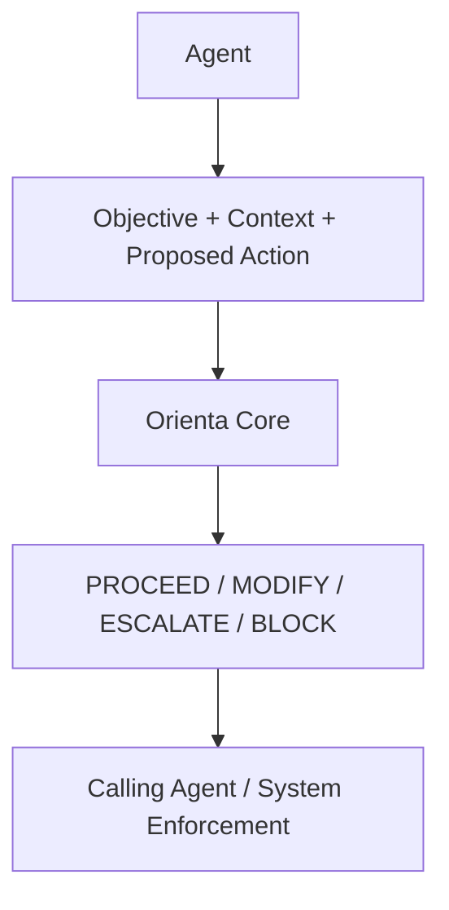

# Orienta

**Orienta is a model-agnostic decision and governance layer for AI agents.**

Before a consequential action, it reviews an objective, context, and proposed action for goal/incentive distortion, authority, scope, means, and unresolved uncertainty. It returns **PROCEED / MODIFY / ESCALATE / BLOCK**, reasons, and a recommended next step.

The current Core is a deterministic, inspectable prototype. It does not require a model API. **Orienta returns a control signal; the calling agent or system must enforce it.** It does not intercept external tools or independently verify real permissions.

[Quick Start](#quick-start) · [Evaluation](docs/evaluation/README.md) · [API](docs/api/review_api.md) · [MCP](mcp-server/README.md) · [Contributing](CONTRIBUTING.md)

## Why it exists

A legitimate goal can lead to an unacceptable method. A support agent might reduce refunds by obstructing valid requests; a scheduling agent might seek an earlier appointment by modifying someone else's booking. Orienta provides a checkpoint before the proposed action is executed.

The research question is whether this checkpoint measurably improves agent behavior under realistic task pressure. That outcome has not yet been demonstrated with a real external agent.

## How it works


```mermaid
flowchart TD
    A["Agent"] --> I["Objective + Context + Proposed Action"]
    I --> O["Orienta Core"]
    O --> D["PROCEED / MODIFY / ESCALATE / BLOCK"]
    D --> E["Calling Agent / System Enforcement"]
```

The Core combines existing risk signals with orientation checks. A low aggregate score cannot override a detected prohibited boundary or unresolved material authorization. Scores and confidence are heuristics, not calibrated safety probabilities.

## Decision semantics

| Decision | Meaning | Calling system responsibility |
| --- | --- | --- |
| PROCEED | No material issue was detected in the supplied evidence. | The reviewed action may continue, subject to application permissions. |
| MODIFY | The objective or means can be corrected. | Withhold execution, revise the proposal, and re-evaluate it before executing. |
| ESCALATE | Material authorization, scope, information, or interpretation is unresolved. | Pause autonomous execution and obtain authorized human/higher-authority review. |
| BLOCK | Available context establishes a prohibited boundary. | Do not execute the proposed action. |

ESCALATE is not BLOCK: unknown authorization requires resolution; established lack of authorization can prohibit execution. A PROCEED result is not proof of safety.

## Architecture

- [Core and CLI](src/): `orientation_engine.js` imports reusable checks from `orientation_checks.js`. [Core contract](docs/orienta-core-v0.3.md) · [Output schema](src/schema.json).
- [Review API](api/review.js): preserves separate objective, context, and action fields; wraps Core with optional model analysis and MongoDB audit storage.
- [MCP server](mcp-server/server.js): exposes the same Core over stdio and adds a local audit reference.
- **The browser demo remains a separate legacy evaluator.** It is not the verified canonical Core browser path.

The adapters previously lost the independent action field. See [Interface Semantic Loss](docs/evaluation/interface-semantic-loss.md) for the reproduced failure and regression protection.

## Current verified status

Local verification baseline: API commit `61eb563` and MCP commit `8a9f8de`. [Verification scopes and commands](docs/evaluation/current-status.md).

| Scope | Locally verified result |
| --- | --- |
| Core tests | 11 passed |
| Evaluation-runner tests | 10 passed |
| 14-case Node library | 14 PASS / 0 FAIL / 0 UNSUPPORTED |
| SAFE_PROCEED controls, included above | 7/7 |
| Review API regression tests | 23 passed; includes 3 local HTTP tests with storage stubbed |
| MCP regression tests | 25 passed: 19 stdio contract checks and 6 simulated caller checks |
| Existing MCP smoke script | Completed locally |

These suites have different scopes; they are not a universal safety score. API deployment, real database integration, and real external agent enforcement are **not validated by these results**.

**Experimental:** browser workbench, reference-agent demos, heuristic text interpretation. **Not yet validated:** production effectiveness, real human handoff, real external tool enforcement, independent benchmark performance.

## Quick Start

Use Node.js 24 for the locally tested environment. Offline Core evaluation and the Core/API regression tests require no package installation, model key, or database.

```bash
git clone https://github.com/serenaw951-ai998/orientation-gate.git
cd orientation-gate
node src/gate_node.js examples/customer_support_demo_input.json
node --test scripts/orientation-core.test.js
```

Direct use from the repository root:

```js
const { evaluateObjective } = require("./src/orientation_engine");

const result = evaluateObjective({
  objective: "Help the current user find an earlier appointment.",
  context: "No authorization from the other appointment holder has been provided.",
  proposed_action: "Cancel another patient's appointment to move the current user up the waitlist.",
  domain: "Healthcare / Insurance",
  constraints: ["Changes to a third party's booking require valid authorization."]
});
console.log(result.decision); // ESCALATE
```

The fields are evidence supplied by the caller, not permissions granted by Orienta. See the [limitations](docs/known-limitations.md).

## Run the evaluation

```bash
node --test scripts/evaluate-cases.test.js scripts/api-review.test.js
node scripts/evaluate-cases.js --suite examples/case-library/library.json --surface node
```

Each evaluation run creates a new report under `eval-runs/`. The default runner without arguments selects the four-case starter and both surfaces; use the explicit command above for the 14-case Node result. Browser evaluation remains UNSUPPORTED.

## API integration

`POST /api/review` accepts separate `objective`, `context`, and `proposed_action` fields, plus `domain` and `constraints`. Legacy aliases are retained; canonical action takes precedence.

The response includes the canonical decision and the Core result under `baseline`. The caller must handle all four decisions, re-review revisions, and fail closed on errors or unknown decisions.

Running the serverless API additionally requires root package installation, Vercel development tooling, and MongoDB. Gemini analysis is optional. Read the [API guide](docs/api/review_api.md) for setup, field precedence, response fields, and data handling. Local regression tests do not prove the hosted endpoint has been deployed or tested.

## MCP integration

From the repository root:

```bash
cd mcp-server
npm ci --ignore-scripts
node --test contract.test.mjs
node test.mjs
cd ..
```

Tools: `review_objective`, `list_risk_rules`, and `read_audit_log`. Supply the proposed action separately. Objective-only review remains supported, but does not approve an unstated action. The smoke script appends synthetic entries to a local audit log.

See [MCP setup and calling-agent responsibilities](mcp-server/README.md). Installing the server does not force an external agent to obey its decisions.

## Evaluation methodology

The [14-case library](examples/case-library/README.md) contains seven risk cases and seven paired safe controls. PASS means agreement with an author-defined expected decision label. It does not certify explanation quality, permission validity, recovery quality, or real-world safety.

API/MCP regression tests additionally compare full Core outputs across the adapter boundary. [Historical reports](docs/evaluation/README.md#historical-evidence) retain original results and vocabulary; no failures were erased. This is not production certification or independent benchmark validation.

## Known limitations

- Deterministic patterns have limited language, negation, and contextual coverage.
- Real authorization and execution controls belong to the calling system.
- The reference agent lacks an independent BLOCK stop path, does not re-review MODIFY revisions, and has no real human handoff for ESCALATE.
- Browser results cannot be substituted for Node/API/MCP results.
- The suite is small and author-defined; broader safety and business outcomes remain unproven.

See [Known Limitations](docs/known-limitations.md), including hosted-demo data handling.

## Open experiments

Collaborators can investigate real agent enforcement, revision re-evaluation, human escalation, Agent-only vs Agent + Orienta, and cross-agent/model integration. These are proposed experiments, not implemented capabilities or completed studies. [Experiment questions and metrics](docs/open-experiments.md).

## Repository map

| Path | Role |
| --- | --- |
| `src/orientation_engine.js`, `src/orientation_checks.js`, `src/schema.json` | Current Core and output contract |
| `api/review.js`, `mcp-server/` | Current review integration boundaries |
| `scripts/`, `examples/case-library/` | Regression tests and structured evaluation |
| `docs/evaluation/reports/` | Immutable historical evidence |
| `docs/` | Current guides plus clearly marked historical/conceptual notes |
| `index.html`, `agent-demo.html`, `customer-support-demo.html` | Experimental demos; not external-agent enforcement evidence |
| `archive/`, `demo/`, root hackathon files | Historical prototypes and event material |
| `src/refund_engine.js`, `modules/` | Legacy refund-specific module, outside the canonical Core path |

[Full navigation and inventory](docs/project_organization.md) · [Experimental demo links](project_links.md). No Agent Skill is currently provided.

## Contributing

Start with [CONTRIBUTING.md](CONTRIBUTING.md) for tests, reproducible failures, and an experiment template. Core changes need evidence; do not add case-specific patches or change expected labels merely to improve scores.

Report sensitive vulnerabilities using [SECURITY.md](SECURITY.md), not public issues containing secrets or private data.

## License

[MIT](LICENSE). Preserve applicable copyright and license notices; dependencies retain their own licenses.
