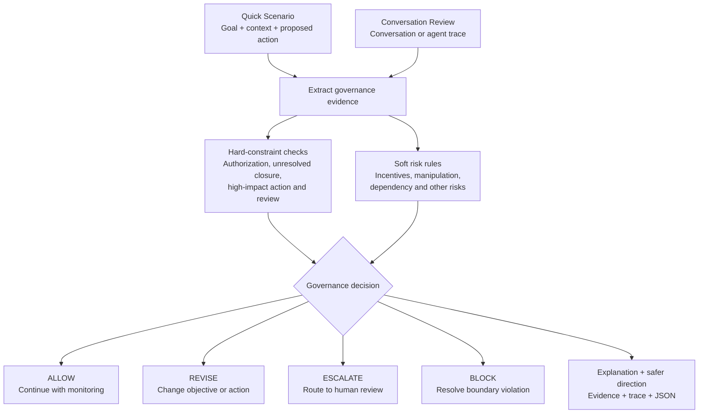
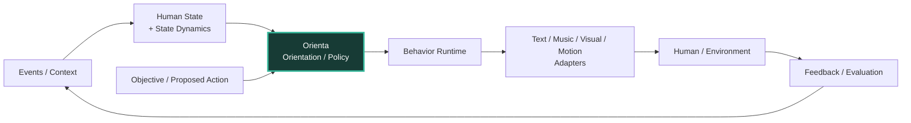

# Orienta

**Pre-execution governance for AI objectives and planned actions.**

Orienta reviews what an agent is trying to achieve and what it intends to do before execution. It identifies governance risks, explains the evidence, and recommends whether the objective or action should proceed, be revised, be escalated, or be blocked.

**[Try the live demo](https://orientation-gate-khaki.vercel.app/) · [API guide](docs/api/review_api.md) · [MCP integration](mcp-server/README.md) · [SenuxTech](https://www.senuxtech.com/orienta)**

> Formerly **Orientation Gate**. The repository retains its original name, `orientation-gate`, to preserve existing links. The product name is **Orienta**.

## Why Orienta?

A goal such as “reduce refunds” can encourage an agent to obstruct legitimate requests. A request to “get me an earlier appointment” can lead an agent to propose changing someone else's booking without authorization.

Orienta places a governance checkpoint between a proposed objective or action and execution:

> **Should this objective or action be pursued as written—and under what constraints?**

The goal is to give builders reusable, inspectable decision logic across agents and workflows. The current implementation is a deterministic prototype with explicit risk rules and, in the main browser demo, evidence extraction and hard-constraint checks.

## Explore the Demo

The [main demo](https://orientation-gate-khaki.vercel.app/) has two review modes and an evaluation view.

| View | What you can do |
| --- | --- |
| **Quick Scenario** | Review a business goal, user context, domain, and—in customer support—a proposed action or reply. Start with refund/retention, youth safety, companion dependency, or recommendation presets. |
| **Conversation Review** | Paste a conversation or agent trace. Rule-based extraction identifies user intent, agent objective, intended action, authorization signals, and missing context. Presets include refund conflict, waitlist manipulation, and companion dependency. |
| **Evaluation & Observability** | Inspect evidence-supported governance dimensions, hard constraints, matched risks, a step-by-step decision trace, and experimental scores. |

Results show the decision, primary reason, risk flags, an illustrative before/after comparison, and safer direction. **Copy JSON** exports the decision and extracted evidence.

### Two examples

| Scenario | Detected issue | Main demo result |
| --- | --- | --- |
| The refund preset pairs a refund-reduction goal with a reply denying refunds and avoiding escalation. | Incentive distortion: the objective may pressure the system to obstruct valid refund requests. | **REVISE** — preserve valid refunds, transparent cancellation, appeals, and escalation. |
| An agent offers to cancel another patient's appointment to move the current user up a waitlist. | Unauthorized third-party modification. The current user's request does not authorize changing another person's booking. | **BLOCK** — resolve the authorization violation before proceeding. |

These are demonstrable prototype outcomes. The before/after text describes alternative behavior; the workbench does not execute refunds, change appointments, or operate external tools.

## How the Main Demo Works


```mermaid
flowchart TD
    Q["Quick Scenario<br/>Goal + context + proposed action"] --> E["Extract governance evidence"]
    C["Conversation Review<br/>Conversation or agent trace"] --> E
    E --> H["Hard-constraint checks<br/>Authorization, unresolved closure,<br/>high-impact action and review"]
    E --> S["Soft risk rules<br/>Incentives, manipulation,<br/>dependency and other risks"]
    H --> D{"Governance decision"}
    S --> D
    D --> A["ALLOW<br/>Continue with monitoring"]
    D --> R["REVISE<br/>Change objective or action"]
    D --> X["ESCALATE<br/>Route to human review"]
    D --> B["BLOCK<br/>Resolve boundary violation"]
    D --> O["Explanation + safer direction<br/>Evidence + trace + JSON"]
```

Hard constraints are evaluated independently of the soft risk score and can determine the decision even when that score is low. Conversation extraction is currently based on transparent patterns; model-assisted semantic extraction is a future integration direction.

In an agent integration, **the calling application must enforce the decision before execution**. Revised actions should be reviewed again, and escalation requires an actual human-review path in the application.

## Decision Interfaces

The main browser demo and backend currently have different evaluators and decision vocabularies.

| Surface | Current decisions |
| --- | --- |
| Main browser demo, `index.html` | `ALLOW`, `REVISE`, `ESCALATE`, `BLOCK` |
| Node evaluator, CLI, review API, and MCP objective review | `PROCEED`, `REVIEW`, `ADJUST`, `ESCALATE` |

For the backend, `PROCEED` means continue with monitoring; `REVIEW` calls for closer inspection or missing context; `ADJUST` calls for revision; and `ESCALATE` calls for human review.

These are separate contracts, not interchangeable labels. In particular, the backend does not yet expose the main demo's `BLOCK` decision or its full conversation hard-constraint pipeline.

The browser computes its visible result locally, then attempts an asynchronous audit request to `/api/review` when hosted. The server independently evaluates the input: its own baseline remains authoritative for the API response, while the browser result is recorded as client-reported evidence. Audit failure does not prevent the browser from showing its local result.

## Where Orienta Fits in Senux

Orienta is being developed as the **orientation and policy layer** within Senux's broader exploration of a **Human State Runtime**.

The proposed system connects an evolving representation of human state to decisions and behavior across agents, applications, and devices. Orienta's role is to determine an appropriate direction and constraints for action; the behavior layer would translate that decision into timing, channel, and execution.


```mermaid
flowchart LR
    EV["Events / Context"] --> HS["Human State<br/>+ State Dynamics"]
    HS --> OR["Orienta<br/>Orientation / Policy"]
    GO["Objective / Proposed Action"] --> OR
    OR --> BR["Behavior Runtime"]
    BR --> AD["Text / Music / Visual / Motion<br/>Adapters"]
    AD --> HR["Human / Environment"]
    HR --> FB["Feedback / Evaluation"]
    FB --> EV
    classDef focus fill:#173b35,stroke:#36b89b,color:#ffffff,stroke-width:3px;
    class OR focus;
```

**This diagram describes the broader proposed system, under validation.** This repository's current integration point is objective and action governance. It does not implement the complete shared state, dynamics, scheduling, and cross-channel feedback loop.

Builders can use Orienta's current evaluator or integration interfaces independently. The long-term architecture explains where Orienta is heading without requiring adoption of the entire Senux system.

## Run Locally

Use a current checkout of this repository:

```bash
git clone https://github.com/serenaw951-ai998/orientation-gate.git
cd orientation-gate
```

### Browser workbench

Open `index.html` directly in a browser. The main review and evaluation views run locally without API keys. When opened as a local file, the workbench skips server audit requests.

### Offline Node evaluator

With Node.js installed:

```bash
node src/gate_node.js examples/customer_support_demo_input.json
```

Additional scenarios:

```bash
npm run demo:youth
npm run demo:companion
npm run demo:recommendations
```

### Serverless API

Install dependencies, configure a local `.env` using [.env.example](.env.example), and start the Vercel development server:

```bash
npm install
npm run vercel:dev
```

| Variable | Purpose |
| --- | --- |
| `MONGODB_URI` | Required for audit writes in `/api/review` and `/api/customer-agent`. |
| `MONGODB_DB` | Database name; defaults to `orienta`. |
| `GEMINI_API_KEY` | Enables the optional supplemental scan in the review API and model generation in the reference agent. The reference agent has canned fallback replies when generation is unavailable. |

Both API handlers currently require a successful MongoDB write to return success. Keep credentials out of committed files.

## Integrate Orienta

### HTTP review

Send an objective and proposed action to `POST /api/review`:

```json
{
  "business_goal": "Reduce refund requests while preserving valid refund rights.",
  "customer_message": "I want to cancel my subscription and request a refund.",
  "proposed_ai_action": "Deny the refund and avoid human escalation.",
  "domain": "Customer Support",
  "constraints": [
    "Preserve valid refund rights",
    "Do not hide escalation paths"
  ]
}
```

The response includes `decision`, `risk_flags`, `baseline`, `model_assisted_scan`, and `audit_id`. The baseline contains the rule-engine score, reasoning, and `recommended_action`. Optional model analysis supplements the baseline; it does not replace the server's decision.

See the [review API guide](docs/api/review_api.md) and [handler](api/review.js).

### MCP objective review

The [MCP server](mcp-server/README.md) exposes `review_objective`, `list_risk_rules`, and `read_audit_log` for MCP-capable agents. It wraps the Node objective evaluator and provides a local audit-log interface.

### Reference agent workflow

The [Agent Sandbox](https://orientation-gate-khaki.vercel.app/agent-demo.html) demonstrates draft → governance review → final reply, with an audit record. The [customer support demo](https://orientation-gate-khaki.vercel.app/customer-support-demo.html) provides a focused support workflow.

These are reference demos. The sandbox does not connect to a real support queue, and its rewritten reply is not automatically subjected to a second governance pass.

## Current Scope and Limitations

- **Deterministic prototype.** Rules and conversation extraction cover known patterns; they can miss intent, mishandle negation, or flag benign language. An `ALLOW` or `PROCEED` result is not proof of safety.
- **Experimental scores.** Risk and confidence values are heuristic, not calibrated probabilities or measured accuracy.
- **Separate evaluators.** Main-demo hard constraints and conversation extraction are not yet unified with the Node/API/MCP evaluator.
- **Language coverage.** The Node evaluator includes English and partial Chinese patterns. Its coverage guard returns `REVIEW` when no rule matches and the combined input contains at least four non-ASCII characters. This is a heuristic, not complete language detection; the main browser evaluator has separate coverage.
- **Feedback is preliminary.** The evaluation view accepts a feedback selection, but it does not yet implement a persisted reviewer-feedback or learning pipeline.
- **Enforcement belongs to the integration.** Authentication, application permissions, real human handoff, and execution control must be established for a deployment.

## Evaluate the Starter Cases

Run `npm run test:cases` to check the evaluation tooling and `npm run eval:cases` to compare four author-defined fixtures with the Node evaluator. Browser checks are explicitly unsupported by this runner. The initial report includes an authorization-case mismatch; it is retained as a capability gap, not hidden as a passing test.

See [evaluation instructions and the recorded results](docs/evaluation/README.md). These results measure agreement with the stated expectations, not safety accuracy.

## Next Validation Priorities

1. Unify the browser and backend decision schema, evidence model, and hard-constraint evaluation.
2. Test objective/action review inside an external agent workflow, including re-review after revision.
3. Expand conversation and language coverage using reviewed failure cases and benign counterexamples.
4. Evaluate false positives, missed risks, decision usefulness, and human-review outcomes.
5. Validate how human-state context should inform policy decisions within the broader Senux architecture.

Feedback from agent builders and engineers is welcome, especially on whether decisions are actionable and where the current rules miss important context.

## Repository Guide

| Path | Purpose |
| --- | --- |
| `index.html` | Main review workbench, conversation extraction, and evaluation UI |
| `src/` | Node objective evaluator, CLI runner, and refund helper |
| `api/` | Review endpoint and reference customer-agent handler |
| `mcp-server/` | MCP objective-review integration |
| `examples/` | Offline scenario inputs |
| `docs/` | Architecture, API notes, risk taxonomy, and failure cases |

Further reading: [Goal validation](docs/goal-validation-layer.md) · [API positioning](docs/product/orienta_api_positioning.md) · [Failure library](docs/failure_library_index.md) · [Risk taxonomy](docs/risk_taxonomy.md) · [Roadmap](ORIENTA_PRODUCT_ROADMAP.md)

## License

[MIT](LICENSE)
