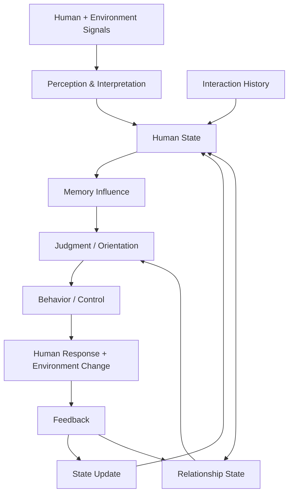
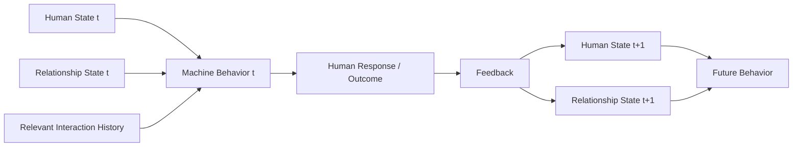
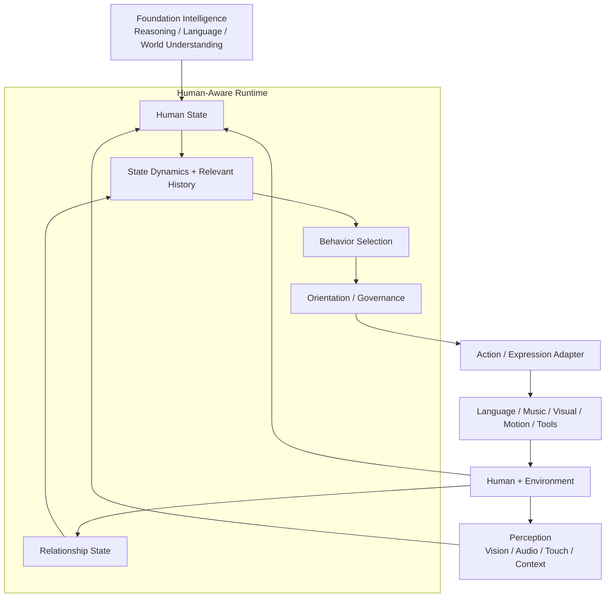

# Human State Origin Thesis

> **Human understanding becomes meaningful to an intelligent system when it persists as state, influences memory and judgment, alters behavior, and evolves through feedback. This continuous loop may form a computational foundation for virtual empathy and long-term human–machine relationships.**

## 1. Origin

The original motivation for Human State is **not to make machines look or act more human**. It is also not simply an emotion-recognition feature.

The core idea is that a machine's understanding of a person should become part of the machine's operating mechanism. If the system recognizes a person's emotion, energy, tension, intent, needs, or relationship changes but that understanding does not influence memory, judgment, behavior, or control, then the system has detected information without meaningfully using it.

**Understanding should change behavior.**

## 2. From recognition to persistent state

Human signals should not be reduced to isolated labels such as `happy`, `sad`, or `stressed`. Observations should contribute to a persistent and dynamically evolving **Human State**.

Past interactions should not exist only as retrievable memories. They should influence the current state, change the relevance and weight of prior information, and affect future judgment and behavior.

## 3. Core runtime loop

The system therefore moves beyond a simple generative pattern:

`Input → Model → Output`

and toward a continuous adaptive loop:

`Sense → State → Orient → Act → Observe → Feedback → Update → Act Again`

Generation is only one possible expression of behavior. Behavior may also include waiting, asking for clarification, changing tone, changing movement, modifying an action, playing music, approaching, withdrawing, escalating to a human, or choosing not to act.

## 4. Virtual empathy

**Virtual empathy does not require the machine to possess human subjective emotional experience.**

Here it refers to a functional and continuous mechanism in which the system:

1. perceives and estimates a person's changing state;
2. preserves relevant effects of prior interaction;
3. allows that understanding to influence judgment and behavior;
4. observes the person's response;
5. updates its state and future behavior accordingly;
6. maintains continuity across interactions.

Conceptually:

`Virtual Empathy = Perception + State + Memory Influence + Judgment + Adaptive Behavior + Feedback + Continuity`

A system is therefore not empathetic merely because it can generate an empathetic sentence. The stronger test is whether its understanding of the human causes an appropriate behavioral difference and whether feedback changes what it does next.

## 5. Relationship as an evolving state

Long-term human–machine relationships should not be represented only by static profile facts or a prompt such as "care about this user."

The relationship emerges through repeated interaction:

`being understood → response → feedback → system change → different future interaction`

This continuity is a possible computational basis for familiarity, trust, attachment, recognition, reciprocity, and other long-term relationship dynamics.

## 6. Position in a larger intelligent or embodied system

The Human State layer is not intended to replace foundation models, perception systems, robotics control, planning, or physical hardware.

Its potential role is to connect **human understanding** to **machine behavior**.

As AI systems move from generating content toward persistent agents and embodied machines, human-state understanding can become increasingly consequential. A mistaken interpretation in a chat may produce an awkward sentence; a mistaken interpretation in an embodied system can change when, how, or whether the machine acts.

## 7. Research hypothesis

A future testable hypothesis is:

> **In long-term human–AI interaction, behavior driven by a persistent, dynamically updated Human State and Relationship State may produce greater continuity, adaptability, and behavioral appropriateness than behavior driven primarily by immediate context, retrieved memory, or static user profiles.**

This is a hypothesis, not a claim of demonstrated superiority.

A minimal comparison could hold the foundation model and application constant and compare:

`Context / Memory-driven Agent`

versus

`Human-State-driven Agent`

Later experiments could swap the foundation model or embodiment while retaining the same Human State Runtime. If meaningful behavioral continuity survives those swaps, that would provide evidence that part of the system's long-term interaction identity can exist above the foundation model.

## 8. Design principle

> **The goal is not merely for the machine to recognize the human. The goal is for its understanding of the human to persist, to matter, and to change what happens next.**

---

**Status:** Concept / theoretical foundation. This note records the origin thesis and a future research direction; it is not a current implementation requirement or product roadmap commitment.
