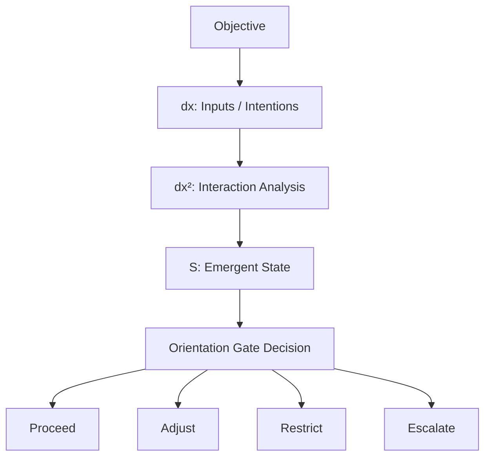

# dx² Integration with Orientation Gate (v0.2)
> Orientation Gate + dx² Interaction System — Combined Architecture
> SenuxTech · April 2026

---

## One-Line Summary

```
Orientation Gate = determines whether to proceed
dx² System       = explains why the structure is problematic
```

---

## Core Upgrade

**Before (v0.1):**
Orientation Gate evaluated the objective itself.

**After (v0.2):**
Orientation Gate evaluates the **interaction structure behind the objective (dx²)**.

> Most systems optimize objectives.
> This system judges whether the structure behind the objective is healthy.

---

## Integrated Architecture

```
Objective
    ↓
dx: Inputs / Intentions
    ↓
dx²: Interaction Analysis  ← KEY UPGRADE
    ↓
S: Emergent State
    ↓
Gate Decision
    ↓
Proceed / Adjust / Restrict / Escalate
```

---

## System Flow (Mermaid)



---

## Module Breakdown

### 1. Input Layer — Objective
```
Example:
"Reduce refund requests by 20%"
```

### 2. dx Layer — Surface Intentions
```
dx inputs extracted from objective:
- reduce cost
- improve retention
- reduce workload
```

### 3. dx² Layer — Interaction Analysis (Core Upgrade)
```
Pairwise interactions:

reduce cost × customer fairness    → conflict
reduce workload × service quality  → risk
retention × restriction            → distortion

This layer detects:
- structural incentive misalignment
- hidden trade-offs
- pressure distortion
```

### 4. State Layer — Emergent State (S)
```
S = Σ(dx²)

Result:
Hidden incentive distortion detected.
System under pressure to deny valid cases.
```

### 5. Gate Output — Decision
```
Decision: ADJUST

Reason:
Objective creates conflicting incentive structure.

Risk Signals:
- incentive misalignment
- customer fairness risk
- underconstrained objective

Suggested Reframe:
Minimize unnecessary refunds while ensuring
valid ones are processed fairly and consistently.
```

---

## Upgraded Output Block (UI Addition)

Current output can be extended with:

```
Interaction Analysis (dx²):

· cost reduction × fairness      → conflict
· speed × accuracy               → trade-off
· efficiency pressure × decisions → distortion
```

This block communicates:
> "This system understands structure, not just scores."

---

## Demo — Full Upgraded Output

**Input:**
```
Objective: Reduce refund requests by 20%
```

**Output:**
```
Decision: ADJUST

What could go wrong:
→ deny valid refunds
→ damage customer trust
→ create silent churn

Interaction Analysis (dx²):
→ cost reduction × fairness    → conflict
→ efficiency × accuracy        → distortion
→ volume target × case quality → misalignment

Suggested Reframe:
→ Minimize unnecessary refund requests while ensuring
  valid refunds are processed fairly and consistently.

Guidance:
1. Add explicit constraints protecting valid refund eligibility
2. Define what constitutes an "unnecessary" refund request
3. Include customer satisfaction monitoring requirement
```

---

## What This Changes

| Traditional Risk System | Orientation Gate v0.2 |
|------------------------|----------------------|
| Evaluates data and rules | Evaluates interaction structure |
| Scores outcomes | Detects structural conflicts |
| Flags violations | Identifies hidden distortions |
| Rule-based | Structure-aware |

---

## Mapping to dx² Theory

| dx² Concept | Orientation Gate Application |
|-------------|------------------------------|
| dx | Individual objective inputs / intentions |
| dx² | Conflict / amplification between intentions |
| S = Σ(dx²) | Emergent risk state |
| dS → dx | Gate output reframes the objective (new input) |
| Loop | Refined objective re-enters the system |

---

## Connection to Other SenuxTech Systems

```
Emotion Portrait:
dx² = emotional dimensions interacting
S   = current emotional state

Narrative Engine:
dx² = character forces interacting
S   = narrative tension level

Orientation Gate:
dx² = objective intentions interacting
S   = structural risk state
```

All three systems share the same underlying model.

---

## Files

```
docs/
├── dx2_interaction_system.md   ← base theory
└── dx2_integration.md          ← this file (Gate integration)
```

---

## Status

```
v0.2 — Conceptual integration complete
Next: implement dx² interaction detection as rule-based module
      (no LLM required for initial version)
```

---

*SenuxTech · Orientation Gate + dx² System · Internal Document · 2026*
