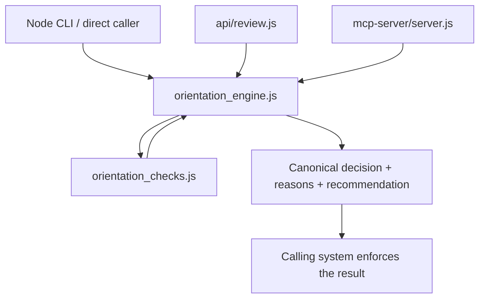

# Orienta Architecture

This describes the committed implementation after the API and MCP action-field fixes. See [Core v0.3](orienta-core-v0.3.md) for checks and historical evolution.

The Core preserves goal-risk signals and adds independent authority, scope, means, and uncertainty checks. It returns PROCEED / MODIFY / ESCALATE / BLOCK. Detected hard orientation conditions can override a low supporting risk score.

The input contract keeps objective, context, and proposed_action distinct. The HTTP adapter supports documented legacy aliases; MCP exposes canonical field names. They both call the same Core and do not implement separate decision rules.

## Wrapper behavior

- CLI/direct use runs locally without a model or database.
- The review API optionally adds Gemini analysis and requires a MongoDB audit write for success.
- MCP writes a local audit entry and returns Core output plus an audit reference.
- Authentication, resource permissions, actual execution control, revision loops, and human handoff belong to the caller.

[API/MCP boundary failures and tests](evaluation/interface-semantic-loss.md) show why a shared evaluator alone is insufficient.

## Separate experimental paths

The inline browser workbench uses its own legacy rules and extraction. It is not a canonical browser adapter.

The reference agent calls Core through its own older input builder. Its rewrite behavior does not implement all four decisions correctly. Neither path is covered by the 14-case Node score. See [Known Limitations](known-limitations.md).

This repository does not implement a complete broader Senux runtime, policy service, permission verifier, or external tool interceptor.
