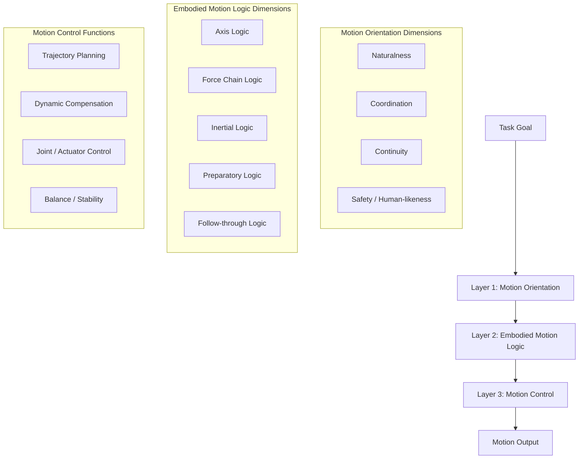

# Motion Orientation Framework

**Most motion systems ask "can this movement be executed?"  
This framework asks first: "what would make this movement good?"**

---

## Overview

This framework proposes a three-layer architecture for designing more human-like, embodied movement systems.

It does not replace existing motion control. Instead, it adds two layers above control to address questions that current systems often skip:

1. **What kind of movement should count as good movement?**
2. **How would a body naturally generate this movement?**

---

## Three-Layer Motion Architecture

---
flowchart TD
    A[Task Goal What should the system do?] --> B[Motion Orientation What kind of movement should count as good movement?]
    B --> C[Embodied Motion Logic How would a body naturally generate this movement?]
    C --> D[Motion Control How can the system execute the movement?]
    D --> E[Motion Output Actual movement in the world]

    B1[Naturalness] --> B
    B2[Coordination] --> B
    B3[Continuity] --> B
    B4[Safety / Human-likeness] --> B

    C1[Axis Logic] --> C
    C2[Force Chain Logic] --> C
    C3[Inertial Logic] --> C
    C4[Preparatory Logic] --> C
    C5[Follow-through Logic] --> C

    D1[Trajectory Planning] --> D
    D2[Dynamic Compensation] --> D
    D3[Joint / Actuator Control] --> D
    D4[Balance / Stability] --> D
---
## Layer 1 — Motion Orientation

### What kind of movement should count as good movement?

This is the highest-level movement-quality layer.

It defines the desired qualities of motion **before execution**, such as:

- Naturalness
- Coordination
- Continuity
- Embodied coherence
- Safety around humans
- Movement style / softness / confidence

This layer does not directly generate motion.  
Instead, it sets the **quality direction** for how movement should be produced.

---

## Layer 2 — Embodied Motion Logic

### How would a body naturally generate this movement?

This is the underlying bodily logic layer.

It describes the deeper internal structure from which movement should emerge:

- **Axis logic** — which body axis initiates, which follows?
- **Force-chain logic** — how does force propagate across joints?
- **Inertial logic** — how does momentum carry through the motion?
- **Preparatory logic** — what micro-movements precede the main action?
- **Follow-through logic** — how does the motion resolve after task completion?

This layer helps translate abstract movement-quality goals into more body-like movement organization.

---

## Layer 3 — Motion Control

### How can the system execute the movement?

This is the conventional control layer.

It handles:

- Trajectory generation
- Posture stabilization
- Force / torque / pressure control
- Dynamic compensation
- Joint-level actuation
- Real-time execution

This layer is responsible for producing the actual motion output.

---

## Core Relationship

| Layer | Question |
|-------|----------|
| Motion Orientation | What should "good movement" mean? |
| Embodied Motion Logic | How should good movement emerge from body-like structure? |
| Motion Control | How do we execute it? |

**One-line summary:**

> Control systems can make a robot move correctly.  
> Orientation and embodied logic help it move like it has a body.

---

## Why Existing Motion Control Often Feels Shallow

### The problem is not execution — it's orientation.

Most current motion systems are highly capable at the execution level. They can:

- Generate smooth trajectories
- Maintain balance under disturbance
- Optimize torque and energy consumption
- Track reference motions with high precision

Yet the resulting movement often feels mechanical, segmented, or "robotic" — even when technically correct.

### What's missing?

The issue is not that the control layer is weak.  
The issue is that **nothing above it defines what "good movement" should look like in the first place.**

Without Motion Orientation and Embodied Motion Logic, the system optimizes for:

- Task completion
- Energy efficiency
- Trajectory smoothness

But not for:

- **Naturalness** — does the motion look like it came from a body?
- **Continuity** — does the movement flow, or does it stop-start between subtasks?
- **Preparatory structure** — does the body "set up" before acting?
- **Follow-through** — does the motion resolve naturally, or cut off abruptly?

---

### Example 1: A robotic arm handing an object to a human

**Typical approach:**
- Plan shortest or smoothest path from A to B
- Stop at handover point
- Wait for grip confirmation
- Retract

**What's missing:**
- No anticipatory adjustment (the arm doesn't "offer" — it just arrives)
- No force-chain continuity (wrist, elbow, shoulder don't coordinate as a unit)
- No follow-through (motion terminates abruptly after release)

The motion is correct. But it doesn't feel like a body handing you something.

---

### Example 2: A bipedal robot turning while walking

**Typical approach:**
- Decelerate current gait
- Rotate body toward new heading
- Accelerate into new direction

**What's missing:**
- No axis pre-rotation (humans initiate turns from the pelvis/spine before the legs follow)
- No inertial blending (the turn feels like three separate phases, not one continuous motion)
- No stylistic continuity (the robot "solves" the turn, but doesn't "move through" it)

The robot turns. But it doesn't turn like a body turns.

---

## Origin: Physical Intuitions Behind This Framework

The Embodied Motion Logic layer was not designed top-down.  
It emerged from observing three physical phenomena:

### 1. Propeller (螺旋桨)
- Rotation generates thrust
- Force transmits along an axis
- → Insight: **Axis logic** — movement has directional priority

### 2. Gyroscope (陀螺)
- Angular momentum creates stability
- The axis resists perturbation
- → Insight: **Inertial logic** — momentum carries through motion and resists abrupt change

### 3. Centrifugal motion (离心运动)
- Rotation generates outward force
- Force radiates from center to periphery
- → Insight: **Force-chain logic** — force propagates across joints in a connected sequence

These three physical patterns became the foundation for asking:

> If a movement system should behave more like a body, what underlying motion logic should it follow?

---

## What This Framework Is (and Is Not)

| This framework is | This framework is not |
|-------------------|----------------------|
| A conceptual architecture | A ready-to-run algorithm |
| A way to organize motion system design | A replacement for motion control |
| A set of questions to ask before implementation | A set of answers that apply to all systems |

If you want to implement this framework, each layer will require its own algorithms.  
This document defines **what those algorithms should do**, not **how to write them**.

---

## Algorithm Requirements by Layer

### Layer 1: Motion Orientation

**Needed:** An evaluator or constraint generator that defines "good movement"

- Input: Task goal, context, safety requirements
- Output: Quality constraints (e.g., "motion should feel soft", "prioritize continuity over speed")
- Possible approaches: Rule-based, learned from human motion data, LLM-guided

### Layer 2: Embodied Motion Logic

**Needed:** A motion organization module that translates quality goals into body-like structure

- Input: Quality constraints from Layer 1
- Output: Motion organization parameters (axis priority, force-chain sequence, preparatory cues)
- Possible approaches: Physics-based models, biomechanics-informed rules, motion primitive libraries

### Layer 3: Motion Control

**Needed:** Standard control algorithms

- Input: Organized motion targets from Layer 2
- Output: Joint commands, actuator signals
- Existing solutions: MPC, RL policies, PD control, trajectory optimization

---

## License

MIT

---

## Author

Serena Wang  
[SenuxTech](https://github.com/SenuxTech)
